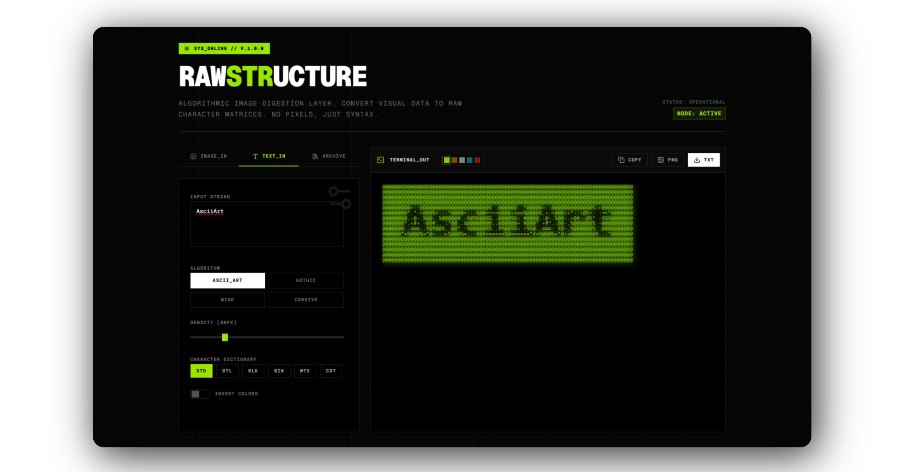

# AsciiArrt

**Algorithmic image digestion layer. Convert visual data to raw character matrices. No pixels, just syntax.**

[AsciiArrt](https://asciiarrt.sukhjitsingh.me) is a web-based utility for transforming standard web images and strings into structured, retro-terminal text outputs. It removes modern gradients, curves, and standard rendering to produce striking monochromatic character matrices reminiscent of pure command-line interfaces.



## Features

- 📸 **Image Digestion**: Convert imported `.png`, `.jpg`, and standard images directly into character grids.
- 🔤 **Raw Data Injection**: Accept text string inputs and algorithmically process them into Gothic, Fullwidth, Cursive, or traditional ASCII macros.
- ⚙️ **Parameter Tuning**: Real-time adjustable density parsing (20px to 300px resolutions).
- 🎨 **Phosphor Modes**: Emulate classic CRT terminal signals (Lime, Amber, White, Cyan, Red).
- 🧩 **Dictionary Algorithms**: Swap between different structural dictionaries (Standard, Detailed, Blocks, Binary, Matrix).
- ⌨️ **Custom Character Injections**: Input localized custom dictionaries (e.g. `01@#`) for custom structural outputs.
- 🌗 **Invert Processing**: Swap algorithms from dark-to-light to light-to-dark.
- 💾 **Data Export**: Support for instant local `.png` and raw `.txt` extraction functionality.

## Tool Stack

- **Framework**: Next.js 15 (React 19)
- **Styling**: TailwindCSS V4
- **Language**: TypeScript
- **Dependencies**: `html-to-image` for PNG canvas ingestion, `lucide-react` for SVG matrices.

## Getting Started

First, run the development node:

```bash
npm run dev
# or
yarn dev
# or
pnpm dev
# or
bun dev
```

Open [http://localhost:3000](http://localhost:3000) with your browser to launch the terminal module.

## Deployment

The easiest way to deploy this application is to use the [Vercel Platform](https://vercel.com/new?utm_medium=default-template&filter=next.js&utm_source=create-next-app&utm_campaign=create-next-app-readme) from the creators of Next.js.
